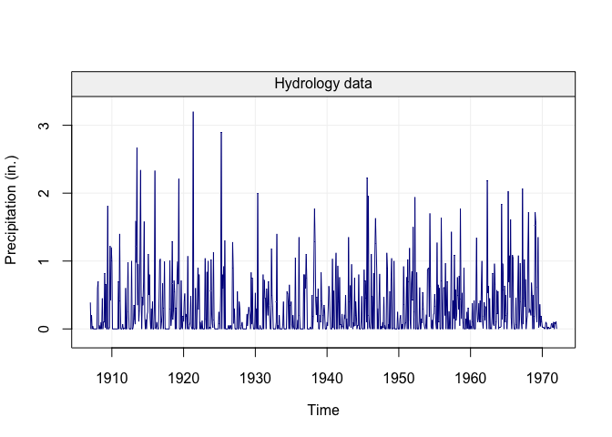
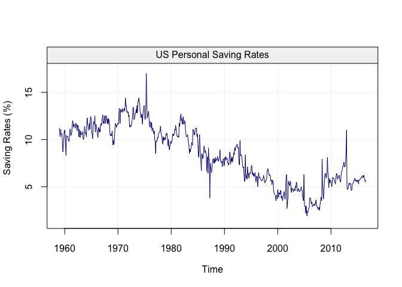
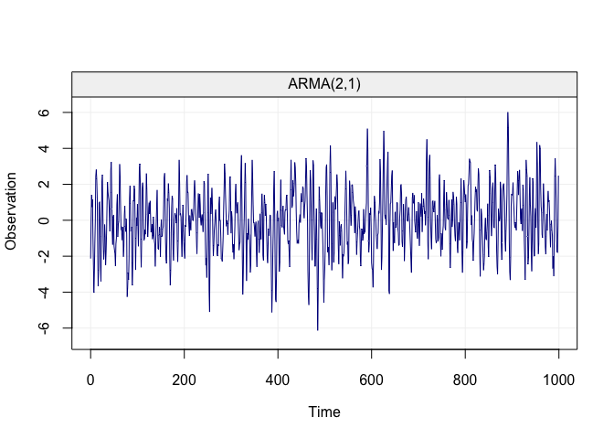
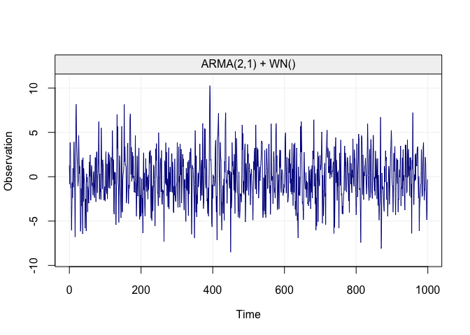
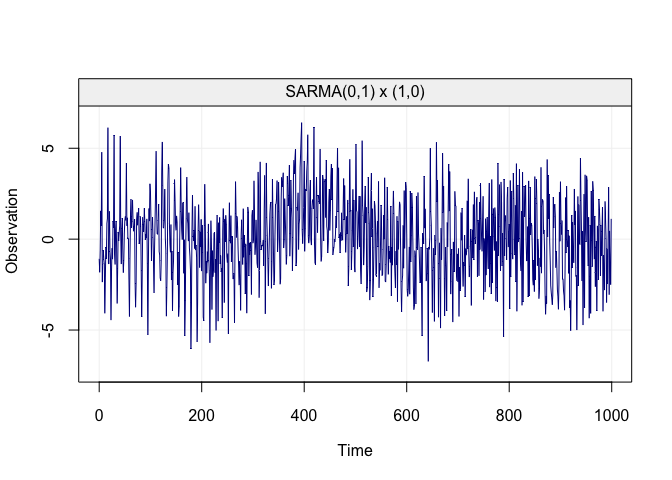

<!-- README.md is generated from README.Rmd. Please edit that file -->
`simts` R Package
=================

This repository holds the Time Series Simulation (simts) R package.

Below are examples of the capabilities of the `simts` package.

``` r
datasets::Nile
#> Time Series:
#> Start = 1871 
#> End = 1970 
#> Frequency = 1 
#>   [1] 1120 1160  963 1210 1160 1160  813 1230 1370 1140  995  935 1110  994
#>  [15] 1020  960 1180  799  958 1140 1100 1210 1150 1250 1260 1220 1030 1100
#>  [29]  774  840  874  694  940  833  701  916  692 1020 1050  969  831  726
#>  [43]  456  824  702 1120 1100  832  764  821  768  845  864  862  698  845
#>  [57]  744  796 1040  759  781  865  845  944  984  897  822 1010  771  676
#>  [71]  649  846  812  742  801 1040  860  874  848  890  744  749  838 1050
#>  [85]  918  986  797  923  975  815 1020  906  901 1170  912  746  919  718
#>  [99]  714  740

# Install and Load SMAC Data 
install_smacdata()
#> Skipping install of 'smacdata' from a github remote, the SHA1 (ef856a4f) has not changed since last install.
#>   Use `force = TRUE` to force installation
library(smacdata)

data("hydro")
hydro = gts(as.vector(hydro), start = 1907, freq = 12, unit_ts = "in.", 
            name_ts = "Precipitation", data_name = "Hydrology data")
plot(hydro)
```



``` r
data("savingrt")
savingrt = gts(as.vector(savingrt), start = 1959, freq = 12, unit_ts = "%", 
            name_ts = "Saving Rates", data_name = "US Personal Saving Rates")
plot(savingrt)
```



``` r
n = 1000
model = ARMA(ar = c(0.9, -0.5), ma = 0.3, sigma2 = 1)
Xt = gen_gts(n = n, model  = model)
plot(Xt)
```



``` r

model = ARMA(ar = c(0.9, -0.5), ma = 0.3, sigma2 = 1) + WN(sigma = 4)
Yt = gen_gts(n = n, model  = model)
plot(Yt)
```



``` r
model = SARMA(ar = 0, ma = 0.3, sar = 0.9, sma = 0, s = 10, sigma2 = 1)
Xt = gen_gts(n = n, model  = model)
plot(Xt)
```



Install Instructions
====================

To install the `simts` package, there is currently one option: GitHub (Developmental).

Recommended R Interface
-----------------------

We firmly recommend that any users of this package use the [RStudio IDE](https://www.rstudio.com/products/rstudio/download/) over the default R GUI.

Installing the package through GitHub (Developmental)
-----------------------------------------------------

For users who are interested in having the latest and greatest developments withing wavelets or simts methodology, this option is ideal. Though, there is considerably more work that a user must do to have a stable version of the package. **The setup to obtain the development version is platform dependent.**

Specifically, one **must** have a compiler installed on your system that is compatible with R.

For help on obtaining a compiler consult:

-   [OS X](http://thecoatlessprofessor.com/programming/r-compiler-tools-for-rcpp-on-os-x/)
-   [Windows](https://cran.r-project.org/bin/windows/Rtools/)

Depending on your operating system, further requirements exist such as:

**OS X**

Some user report the need to use X11 to suppress shared library errors. To install X11, visit [xquartz.org](http://www.xquartz.org/)

**Linux**

Both curl and libxml are required.

For **Debian** systems, enter the following in terminal:

``` bash
sudo apt-get install curl libcurl3 libcurl3-dev libxml2 libxml2-dev
```

For **RHEL** systems, enter the following in terminal:

``` bash
sudo yum install curl curl-devel libxml2 libxml2-dev
```

**All Systems**

With the system dependency taken care of, we continue on by installing the R specific package dependencies and finally the package itself by doing the following in an R session:

``` r
# Install dependencies
install.packages(c("RcppArmadillo","ggplot2","reshape2","devtools","knitr","rmarkdown"))

# Install the package from GitHub without Vignettes/User Guides
devtools::install_github("SMAC-Group/simts")
```

Supplementary data package
--------------------------

To test the package performance on real-world data that is *stationary* or work with some of the examples, you will need to download and install the `imudata` and/or the `datapkg` R package.

To do so, please use the following installation method within the `simts` R package:

``` r
# Install the imudata package containing real world IMU data sets
simts::install_imudata()

# Install the datapkg package containing miscellaneous data sets
simts::install_datapkg()
```

For more information about the `imudata` and `datapkg` package, see the <https://github.com/SMAC-Group/imudata> and <https://github.com/SMAC-Group/datapkg>.
